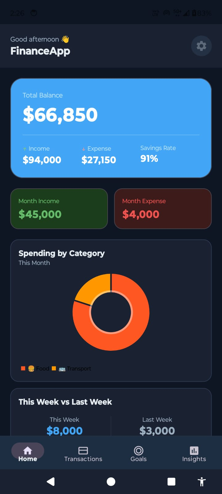
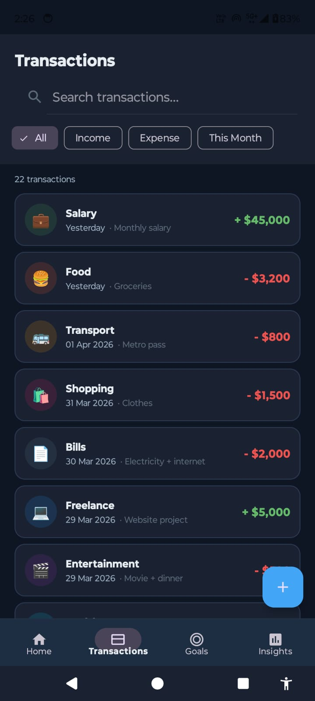

# 💰 FinanceApp - Personal Finance Companion

FinanceApp is a modern Android application built to help users track income, expenses, savings goals, and financial insights — all in one place.

---

## 🚀 Features

### 🏠 Home Dashboard

* View total balance, income, and expenses
* Savings rate calculation
* Weekly comparison insights
* Recent transactions overview

---

### 💸 Transactions

* Add, view, and manage transactions
* Filter by:

  * Income / Expense
  * Time (This Month)
* Search transactions
* Categorized transaction list

---

### 🎯 Goals & Challenges

* Create savings goals
* Track progress with percentage indicators
* Budget challenges with category limits
* Add funds to goals

---

### 📊 Insights

* Income vs Expense visualization (Pie Chart)
* Top spending categories (Bar Graph)
* Monthly and trend analysis

---

### ⚙️ Settings

* Currency selection (INR, USD, EUR, GBP)
* Dark Mode support 🌙
* Budget alerts toggle
* App version info

---

## 🧱 Architecture

This app follows **MVVM Architecture**:

* **UI Layer** → Activities & Fragments
* **ViewModel Layer** → LiveData, state management
* **Repository Layer** → Single source of truth
* **Data Layer** → Room Database + SharedPreferences

---

## 🛠️ Tech Stack

* **Language:** Java
* **Architecture:** MVVM
* **Database:** Room (SQLite)
* **UI:** XML + Material Design 3
* **Charts:** MPAndroidChart
* **Navigation:** Bottom Navigation + Fragments
* **Persistence:** SharedPreferences

---

## 📱 Screenshots

| Home                  | Transactions                  | Goals                  | Insights                  |
| --------------------- | ----------------------------- | ---------------------- | ------------------------- |
|  |  |  |  |

---

## 📂 Project Structure

```
com.financeapp
│
├── ui/                # Activities & Fragments
├── viewmodel/        # ViewModels
├── repository/       # Data handling
├── database/         # Room DB + DAO
├── model/            # Entities
└── utils/            # Helpers
```

---

## ⚡ Installation

1. Clone the repository:

```bash
git clone https://github.com/DevSahil12/FinanceApp.git
```

2. Open in Android Studio

3. Sync Gradle

4. Run the app 🚀

---

## 🎯 Future Improvements

* Cloud sync (Firebase)
* Expense reminders
* Export reports (PDF/CSV)
* Multi-user support
* AI-based spending insights 🤖

---

## 👨‍💻 Author

**Sahil**
Android Developer

---

## ⭐ Show your support

If you like this project, give it a ⭐ on GitHub!
